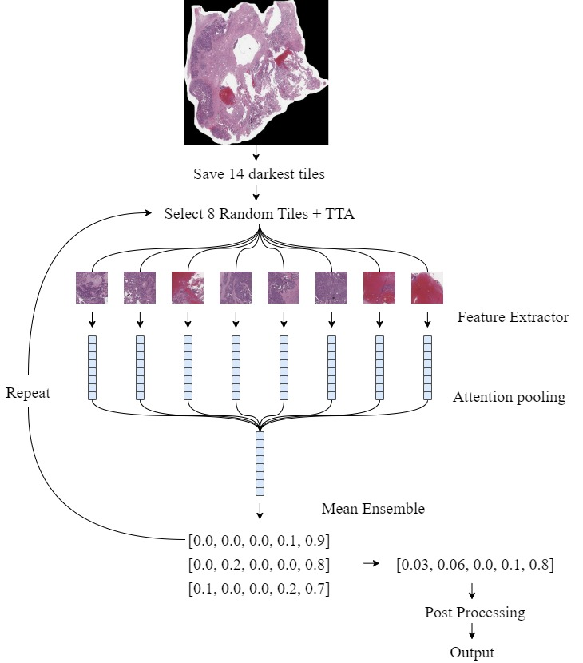
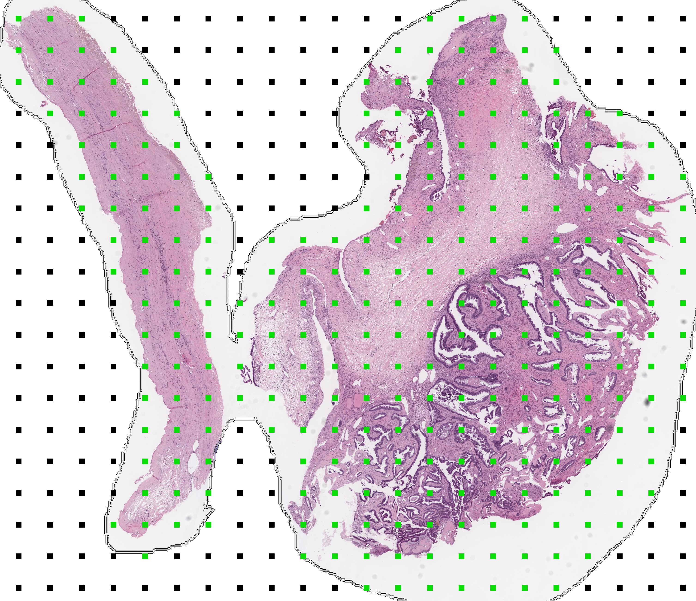
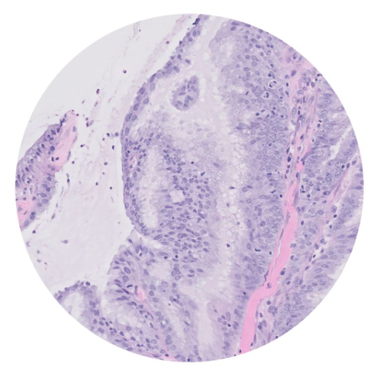

## 20th Place Solution

Our solution for the [UBC-Ocean Competition](https://www.kaggle.com/competitions/UBC-OCEAN) is based on a multiple instance learning (MIL) architecture with attention pooling. We use an ensemble of `efficientnet_b2`, `tf_efficientnetv2_b2.in1k` and `regnety_016.tv2_in1k` backbones trained on sequences of 8 x 1280 x 1280 images, and ignore the `other` class. We also apply light TTA during inference (rot90, flips, transpose, random image order).

<h1 align="center">

</h1>

## Strategies

**Efficient Tiling**

We select tiles from WSIs based on the darkest median pixel value. To make the pipeline more efficient, we use multiprocessing on 3 CPU cores, and prefilter crop locations using the smaller thumbnail images. This prefiltering selects the largest area of tissue on the slide and ignores other smaller areas of tissue.

For TMAs, we take 5 central crops of size 2560 x 2560 and resize to 1280 x 1280 to match WSI magnification. 



Although efficient, a limitation of the pipeline is that it may not extract informative tiles from each image. We experimented with a lightweight tile classifier trained on the ~150 segmenetation masks, but this did not improve tile selection.

**Modeling**

We trained each model for 20-30 epochs with heavy augmentations and SWA (Stochastic Weight Averaging). Most models were trained on all the WSIs and TMAs, but some were trained using synthetically generated TMAs (aka. TMA Planets) from the [supplemental masks](https://www.kaggle.com/datasets/sohier/ubc-ovarian-cancer-competition-supplemental-masks). We would likely have explored TMA planets further but were skeptical of the mask quality, and low count relative to the total number of WSIs.



**OOF Relabel + Remove**

Based on [Noli Alonso's comments](https://www.kaggle.com/competitions/UBC-OCEAN/discussion/445804#2559062), we removed ~5% of the images and relabelled 8 images. We used a similar denoising method to that in the [1st place solution](https://www.kaggle.com/competitions/prostate-cancer-grade-assessment/discussion/169143) of the [PANDA Competition](https://www.kaggle.com/competitions/prostate-cancer-grade-assessment/overview).

```
relabel_dict = {
    '15583': 'MC',
    '51215': 'LGSC', 
    '21432': 'CC',
    '50878': 'LGSC',
    '19569': 'MC',
    '38097': 'EC',
    '29084': 'CC',
    '63836': 'LGSC',
}
```

## External Data

The only external dataset we used was the [Ovarian Carcinoma Histopathology Dataset (SFU)](https://www.medicalimageanalysis.com/data/ovarian-carcinomas-histopathology-dataset). This dataset had 80 WSIs at 40x magnification from 6 different pathology centers.

Class distribution: `{'HGSC': 30, 'CC': 20, 'EC': 11, 'MC': 10, 'LGSC': 9}`

## Did not work for us

- Larger backbones
- Lightweight tile classifier
- Stain normalization (staintools, stainnet, etc.)
- JPGs

## Frameworks

- [Pytorch Lightning](https://lightning.ai/docs/pytorch/stable/) (training)
- [Weights + Biases](https://wandb.ai/site) (logging)
- [Timm](https://huggingface.co/timm) (backbones)


---

Notes for future competitions (not part of write-up).

## Improvements

- Should have looked at using image previews for external data! There were many external TMA datasets that could have been used by cropping from these previews. See [12th place solution](https://www.kaggle.com/competitions/UBC-OCEAN/discussion/465455). One really good source was [tissuearray\[.\]com](https://www.tissuearray.com/tissue-arrays/Ovary), which I found but clicked away before looking at the previews!

- Could have created `Other` class from the `stroma/necrosis` areas of the segmentation masks. This was used in the [10th](https://www.kaggle.com/competitions/UBC-OCEAN/discussion/465415) and [8th](https://www.kaggle.com/competitions/UBC-OCEAN/discussion/465382) place solutions.

- Seems alot of top solutions used larger tile size on WSIs, or multiple magnifications. See [15th place solution](https://www.kaggle.com/competitions/UBC-OCEAN/discussion/465358).

- Should have done model error analysis/denoising earlier. Only explored mislabelled/noisy images in the last couple weeks of the competition, and made large gains by simply dropping ~5% and relabelling 8 images. Did not explore other dropping methods.

- Should have trusted frozen`StainNet` attached to MIL model! This seemed to help generalize to unseen staining methods.

**Positives**

- Team-up. Learned a lot from Kevin. He introduced me to Einops and we had good discussions when brainstorming new ideas and solving problems.
- Modeling. Implemented MIL (Multiple instance learning) models, added HAM (High attention masking), and added heavy augmentations which all helped generalizability.
- Fast inference. Used lightweight backbones, FP16 and DDP. This helped ensemble many models, and maximi
